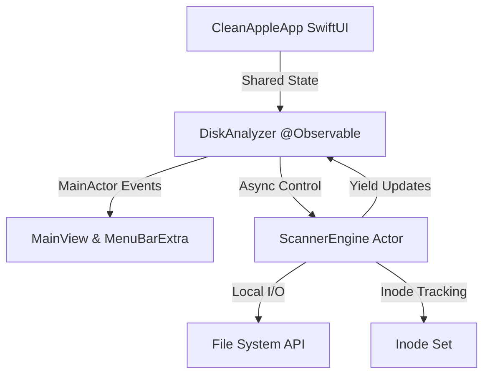

# System Architecture - CleanApple

## Overview
CleanApple is composed of a background execution layer and a modern reactive SwiftUI UI layer. It strictly targets macOS 15+ to leverage Swift 6 concurrency patterns, `@Observable` state management, and native `MenuBarExtra` capabilities.

## Component Map
- **CleanAppleApp**: Entry point managing the life cycle and hybrid scenes (`WindowGroup` + `MenuBarExtra`). Handles drag-and-drop registration.
- **DiskAnalyzer**: MainActor view model handling progress counters, visual state, and haptic triggers.
- **ScannerEngine**: A background `actor` conducting directory crawl recursively. Manages memory overhead via custom `autoreleasepool` boundaries.
- **CSVExporter**: Logic wrapper handling privacy alerts and generating locale-safe CSV sheets (switching between commas and semicolons).
- **QuickLookController**: Bridge to `QLPreviewPanel` allowing native system file previews on Spacebar triggers.

## Key Design Decisions
- **App Sandbox Compliance**: Rather than requesting Full Disk Access and forcing complex onboarding, the app enables App Sandbox and relies on `user-selected.read-only` entitlements. Drag-and-drop or select panel actions implicitly grant permissions.
- **Physical vs. Logical Size**: To account for sparse files and APFS clones, the app queries `totalFileAllocatedSizeKey` instead of `fileSizeKey`.
- **App Nap Exemption**: The engine invokes `ProcessInfo.beginActivity` to maintain background CPU execution priorities when the main window is closed.
- **Memory Optimization**: Rather than creating millions of URLs in memory, the engine trims subdirectory outputs at 250 child nodes, grouping remainder folders as "Other Smaller Files".
