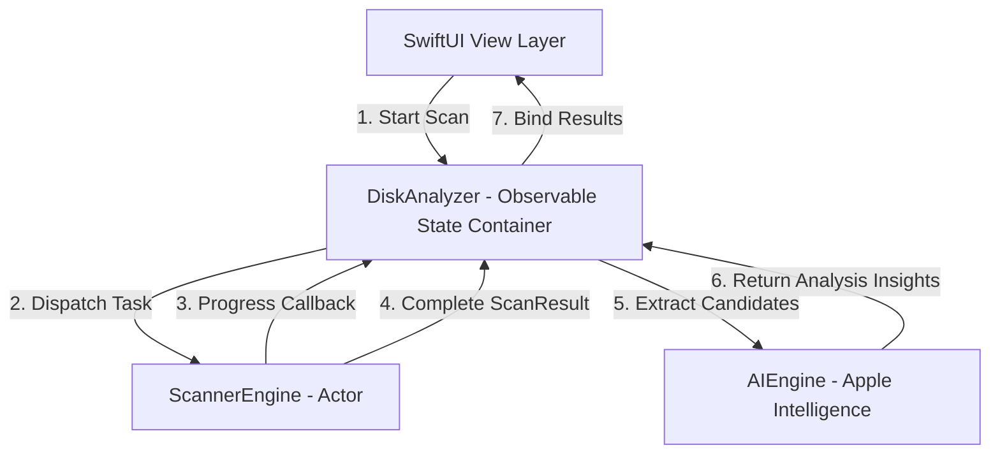

# Pruneapple Architecture

This document describes the architectural design, threading model, and technical optimizations of **Pruneapple**, a native macOS disk space visualizer and cleanup utility.

---

## 1. System Overview

Pruneapple follows a reactive, single-directional state model implemented using SwiftUI's modern `@Observable` framework. The core system is partitioned into three key architectural layers:



1. **View Layer (`SwiftUI`):** Handles rendering, visual transitions, drag-and-drop targets, and displays result lists/treemaps.
2. **State Container (`DiskAnalyzer`):** Serves as the `@MainActor`-bound view-model. It coordinates scanning tasks, tracks real-time progress, manages errors, and drives the AI analysis workflow.
3. **Engines (`ScannerEngine` & `AIEngine`):** Perform the heavy computation. `ScannerEngine` runs off-main-thread concurrent directory traversals, while `AIEngine` handles local structured model inference.

---

## 2. Core Components

### A. State Management: [DiskAnalyzer.swift](file:///projects/apps/pruneapple/Targets/Pruneapple/Sources/DiskAnalyzer.swift)
* **Annotation:** `@Observable @MainActor`
* **Role:** Orchestrates the lifecycle of active tasks.
* **Key Tasks:**
  * Cancels existing scanning tasks when a new scan is started.
  * Dispatches progressive updates (scanned bytes, files, and current scanning paths) to the UI.
  * Triggers trackpad haptic feedback (`NSHapticFeedbackManager`) upon completion.
  * Flattens and filters the result tree to generate file list inputs for the AI engine.

### B. Core Scanning: [ScannerEngine.swift](file:///projects/apps/pruneapple/Targets/Pruneapple/Sources/ScannerEngine.swift)
* **Annotation:** `public actor ScannerEngine`
* **Role:** Recursively crawls folders and aggregates physical disk usage.
* **Key Tasks:**
  * Uses `FileManager.default.enumerator(at:...)` to iterate folders.
  * Tracks and computes physical file sizes rather than logical sizes.
  * Employs resource-saving limits to keep memory utilization minimal during massive scans.

### C. Heuristic AI Analysis: [AIEngine.swift](file:///projects/apps/pruneapple/Targets/Pruneapple/Sources/AIEngine.swift)
* **Role:** Local, on-device analysis of disk files to identify cleanup candidates.
* **Key Tasks:**
  * Filters scanned files to identify heavy candidates (regular files, size $\ge$ 50MB, sorted descending, max 15 items).
  * On macOS 26.0+, attempts local structural generation using `FoundationModels` (Apple Intelligence).
  * Executes a developer safety filter to protect critical files (e.g. `.git`, `.xcodeproj`) from receiving high pruneability scores.

---

## 3. High-Performance Optimizations & Memory Safety

Traversing millions of filesystem nodes on a system drive can cause memory explosion and CPU throttling. Pruneapple implements five key optimizations to prevent this:

### 1. Inode Deduplication & APFS Sizing
* **Physical Sizing:** The scanner queries both `.totalFileAllocatedSizeKey` and `.fileAllocatedSizeKey` to compute physical space. This ensures sparse files and APFS clone-files (copied files that share data blocks) are represented accurately.
* **Hard-Link Deduplication:** A hash set of `FileIdentity` (Volume UUID + Inode Data) tracks visited files. If a file is a hard link and has already been processed, it is skipped.
* *Memory Safety Limit:* To prevent the `seenInodes` set from growing too large, deduplication is only performed on files larger than **1MB**.

### 2. Crossing Volume Boundaries
* The scanner reads the `volumeUUID` of the scan target root. During traversal, if the scanner encounters a folder mounted on a different volume (such as a mounted disk image, network drive, or the read-only `/System` volume boundary), it skips descendants to prevent infinite traversal loops.

### 3. Memory Footprint Mitigation (Trim & Aggregation)
* **Aggregating Small Files:** Files smaller than **10MB** are not instantiated as individual `FileItem` struct nodes. Instead, their sizes are accumulated directly in their parent folder's `smallerFilesSize` property.
* **Trimming Large Lists:** If a single directory contains more than **300 children**, the engine sorts them, retains the top **250 largest**, and accumulates the remaining files into `trimmedFilesSize`.
* **Virtual Representation:** Stale/trimmed files and aggregated smaller files are grouped under a virtual list entry named **"Other Smaller Files"**.
* **Auto-Release Pool:** Scans wrap file iteration in `autoreleasepool` blocks, ensuring dictionary values and paths are immediately garbage collected before memory spikes.

### 4. SwiftUI Update Throttling
* Redrawing a SwiftUI view for every scanned file will crash the main-thread rendering pipeline.
* **Throttling:** In the inner scanning loop, progress notifications are rate-limited to once every **250ms (0.25s)** using `CFAbsoluteTimeGetCurrent()`.

### 5. Prevent App Suspension
* Disk scanning is system-intensive. To prevent macOS from putting the app's threads to sleep or suspending execution, the engine uses:
  ```swift
  let activity = ProcessInfo.processInfo.beginActivity(
      options: [.userInitiated, .latencyCritical],
      reason: "Performing deep disk space analysis"
  )
  ```
  This increases the thread scheduling priority and stops system sleep until the scan completes.

---

## 4. Permissions & System Sandbox Checks

Scanning the user's hard drive requires bypass-level permissions. Pruneapple integrates a robust check pipeline in [PermissionManager.swift](file:///projects/apps/pruneapple/Targets/Pruneapple/Sources/PermissionManager.swift):

### Full Disk Access (FDA) Detection
Rather than waiting for a silent read failure, `checkFullDiskAccess()` runs a three-tier active check against protected system folders (e.g. `/Library/Application Support/com.apple.TCC/TCC.db`, or the user's `Library/Messages` folder):
1. **FileHandle Test:** Attempts to read the target paths using `FileHandle(forReadingAtPath:)`.
2. **Directory Contents List:** Tries to execute `contentsOfDirectory(atPath:)`.
3. **POSIX Raw Open:** Issues a low-level `open(path, O_RDONLY)` system call.

If any of these succeed, Full Disk Access is flagged as `true`. If all fail, the app displays a warning directing the user to System Settings.

### Thread-Safe Permission Error Capture
When the scanner encounters standard read permissions errors (`EACCES` or `EPERM`), a helper class `SkippedTracking` collects the failed paths using an `NSLock`. This collection is passed back in the final `ScanResult` so the user knows which folders were skipped.

---

## 5. Exporters & Localizations

### localized Decimal Handling ([CSVExporter.swift](file:///projects/apps/pruneapple/Targets/Pruneapple/Sources/CSVExporter.swift))
When exporting scan logs to CSV, standard delimiters can cause corruption in different regions.
* **The Issue:** In the US, decimals are periods (`.`) and lists are comma-separated (`,`). In Europe, decimals are commas (`,`) and list elements must be semicolon-separated (`;`) to prevent Excel formatting corruption.
* **Solution:** The exporter dynamically sets the CSV separator symbol based on localized decimal settings:
  ```swift
  let separator = Locale.current.decimalSeparator == "," ? ";" : ","
  ```
* **Data Limit:** Exports are limited to the top **10,000 largest items** to keep file sizes and processing time low.
